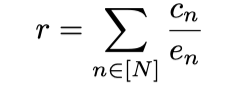
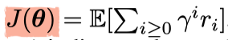
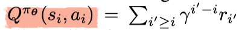
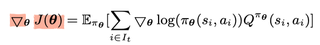
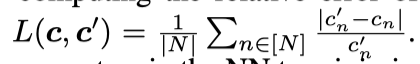

# Deep Learning-based Job Placement in Distributed Machine Learning Clusters

## Abstract
机器学习生产集群托管了大量的分布式机器学习工作量。当作业共享服务器提高了资源利用率的同时，共同协作的机器学习jobs之间的干扰可能会导致严重的性能下降。现有文献资料对干扰敏感作业放置问题采用详细的工作量分类和干扰建模的方法，但这并不是一个普遍的策略。
本文展示了一个深度学习驱动的机器学习集群调度程序Harmony，在执行放置训练jobs任务时某种程度上最小化干扰并最大化性能。Harmony基于精心设计的深度强化学习框架。深度强化学习采用最先进的技术，例如评价器算法、作业敏感行为空间探索以及经验回放，来稳定训练并提高收敛性。本文建立一个辅助奖励预测模型，它使用历史样本数据训练而成并且为`看不见的位置产生奖励`。
在6个GPU服务器的Kubernetes集群中使用实际ML任务进行的实验表明，就平均作业完成时间而言，Harmony优于代表的调度程序25%。
## Introduction
顶尖IT公司在集群上，使用分布式ML框架运行多种多样的ML工作，来支持公司运转。但如何有效在服务器上放置机器学习作业以取得高效的资源利用率并且训练吞吐量，是集群操纵者面临的基本挑战。
同一个服务器上的协作ML作业会干扰彼此，产生不可预测的性能改变。由于保存大量作业的潜在干扰等级很困难，很多现存ML集群上的调度程序对干扰是无意识的。在一些文献中已经重视感知干扰的调度程序，基于观察/假定根据目标性能显式建立了干扰模型，用手工式启发法将干扰纳入调度程序，通常在数十个干扰源下进行小心的应用分类并对启发式学习中的阈值和性能模型里的参数进行仔细的优化。这种方法当工作量类型或者硬件配置改变的时候，启发式方法就不起作用了。
本文为ML作业放置设计了一个黑盒方式，察觉到干扰并且不用依赖于细节的分析性能模型。Harmony在神经网络中隐式编码工作负载干扰，将原始集群和作业状态映射到作业放置决策中。
在开发Harmony的过程中做出了以下`贡献`：
* 提出了使用DRL调度ML工作的通用设计，这能自动适应一些未知变化
* 采用了一些训练方法来解决问题，那些问题可能会防止DRL收敛到一个好的ML作业放置策略
* 在Kubernetes上实现了Harmony系统原型并在GPU集群上用真实的ML作业进行了测试
## Backgroud and Motivation
### A. Distributed Model Training
ML 作业使用大量数据训练模型，最小化迭代的损失函数。由于ML jobs通常是计算密集型的，因而很多ML框架设计成分布式训练。多数采用`PS 架构`，训练数据集分配给多个worker，首先，每一个worker从参数服务器PS上拉取最新的参数更新本地参数。接着，每一个worker使用分配的一部分样本数据对本地复制的模型参数进行训练，计算梯度gradients，再将梯度推到参数服务器上。最后，参数服务器们将收到的所有梯度，使用随机梯度下降（SGD）方法（或其变体）来更新全局参数，这样完成了一个时期的训练。对数据集进行多个时期的训练，直到模型收敛或达到预设的最大时期数为止。
### B. Interference among Co-located ML Jobs
干扰在实际协作ML工作中造成的影响举例：
#### Case study 1: bin packing vs. standalone execution
选择了6个DL jobs，从MXNet官方教程中训练模型。为了简单起见，每个作业使用一个PS和一个worker。
实验一：每个作业在单独的服务器上运行
实验二：6个作业使用多资源装箱技术被打包在3个服务器上运行
比较指标：两个实验中的实验速度s1，s2 -> (s1-s2)/s1 实验速度下降百分比
结论：多资源装箱技术的平均性能下降33%，并且当worker和PS增多时会由于全局同步而导致性能下降更严重。
### Case study 2:pair-wise interference level
将6个DL jobs进行成对协作，然后调查干扰等级，两个作业相对单独作业减速百分比之和。
结论：通过在ML集群上协作干扰小的作业能有效优化资源利用率和训练性能
### Case study 3:placement under representative policies
比较了三种作业放置策略
* load balancing -> 把工作尽可能平均地分发在服务器上 -> Mesos和Kubernetes中使用
* multi-resource bin packing -> google borg 和 Tetris中使用
* standalone execution 
其中standalone execution性能最佳但资源利用率最低，而multi-resource bin packing的性能依据协作任务直接的干扰而定，干扰越大，性能越差，甚至有的时候比load balancing更差。在干扰比较大的时候，协作任务数量越多，性能越差。-> 因此，我们采用通过DRL学习的黑箱策略来安排作业。
### C. Challenges in Applying DRL in Job Placement
#### 难点
* 操作空间`action space`和状态空间`state space`都很大，这通常使得RL由于探索空间不足并且效率低下，无法快速收敛到一个好的决策策略
* 收集足够多的应对多种部署环境的奖励样本轨迹用于DRL训练，存在难度。没有足够样本，把DRL NN训练到收敛至一个好的政策不太可能
#### 本文目标
使用另一种NN进行奖励建模，并通过使用可用迹线的监督学习对其进行训练。

## System overview
本文聚焦于使用PS架构的分布式ML jobs，但也可以拓展到使用全缩减类型的算法来处理作业，以便在worker之间直接进行参数交换。
Harmony以批处理方式调度作业。时间被分为很多小的调度间隔时间。Harmony在每一个间隔时间中批处理并且只处理新来的任务，根据现有服务器上的资源来决定其放置的位置。与很多著名AI 云公司讨论后，在部署后不进行job放置调整是ML集群的规范，并且实际中为运行的作业动态调整资源分配也是非常困难的。
Harmony致力于在服务器能力限制下，最小化ML集群的平均作业完成时间。学习基于DRL的作业放置策略，Harmony将离线训练与在线干扰和模型更新结合起来。
### Offline training
离线训练为在线决策产生一个好的模型。由于DRL需要大量试错从而收敛到一个好的策略，而并不是经常有大量含有样本的历史轨迹数据。为了解决训练样本不足的问题，本文使用奖励预测模型（使用另一个NN）提高了DRL。
离线训练被分为以下两个步骤：
#### Reward model training
使用监督学习训练奖励预测神经网络`reward prediction NN` 
input：作业集信息以及放置状态
label：reward->每项作业的训练速度
该模型为具有相应安置决策的任何作业集提供了快速的奖励评估
output：历史轨迹数据样本
#### DRL model training
input：多种作业集合，可用集群资源
output：集合中新作业的放置策略
数据来源：reward predition model中获得的轨迹和样本数据
### Online inference and model update
使用离线训练的模型进行在线决策。
在每个计划间隔时间中，Harmony通过在DRL NN上​​的放置策略来决定新作业批次的放置，并观察与放置决定相对应的实际奖励。我们使用在线收集的样本定期重新训练DRL NN和奖励NN，以随着时间的推移不断改进决策。

## Deep Reinforcement learning based placement policy
### A. DRL Framework
#### State space
input:`s (x, r, \vec w, \vec p, v, d)`
* x：一个N*L的二维矩阵，对由job训练的ML模型进行编码
    * N -> 一个间隔时间内可以`concurrent job`的最大数量
    * L -> 集群中可以训练模型的最大数量
    * `concurrent job`:包含新来的任务和较早提交未完成的任务。以确定共享服务器上新来任务和已存在任务之间的潜在干扰
    * x矩阵中的 \vec xn ：作业n模型的一次性编码
* r：一个N*2(1+K)的矩阵，对工作中的worker/PS资源需求进行编码
    * K：组成一个worker/PS的资源种类数
    * r矩阵中的\vec rn：第一个值代表job需要的worker数量，接下来的K个值代表每一个worker对K种资源的需求，在接下来的一个值代表job需要的PS数量，最后的K个值表示每一个PS需要的K种资源对应的数量
* \vec w(\vec p)：一个n维向量，wn(pn)代表分配给第n的工作的worker数量（PS数量）
* v：一个M*K矩阵，代表服务器上每种可用资源的数量
    * M：物理服务器数量
    * \vec vm(v[m])：服务器m上各种可用资源数量
* d：一个M×2N矩阵，用于编码服务器上并发作业的worker和PS的放置情况。
    * \vec dm(d[m])：放置在服务器m上的job n中，worker数量和PS数量分别位于d[m][2n-1]和d[m][2n]。
#### Action space
收到s之后，DRL代理根据由NN产生的多推断策略πθ(s, a)，从`action space`中选出一个action，以便为新作业中的所有工作人员和PS提出一套完整的安置决策，这样可以减少`action space`。
此`action space`包含2MN'个如下的行为，其中N'表示间隔时间内的最大的新到达作业数量
* (n, 0, m)：将job n的一个worker放到服务器m上
* (n, 1, m)：将job n的一个PS放到服务器m上
#### Reward
本文设计了每个间隔时间的`reward`在整个工作过程中收集更多的奖励样本，以便RL模型能够更频繁地更新，更快达到收敛状态。
在状态s下采取行动a所观察到的奖励r，是调度间隔时间下所有并发jobs正则化后的训练速度之和。

其中：
c[n]:作业n的训练速度（即此时间间隔内训练的时期数）
e[n]:是作业n应完成的训练时期的总数
r越大，c[n]越大，所需要的间隔时间数量越少，从而最小化了平均工作完成时间。
#### NN model
NN通过层层连接可以在整合成一个整体之前，从每一个job或者每一个服务器中抽取特征。其中一些无效操作的概率被设置成0，随后再重新缩放所有action的概率让和保持1。
### B. DRL Model Training
使用强化算法训练NN策略，通过使用样本计算梯度来更新参数θ。
* 样本：(s, a, r, s' )，s'是状态经过动作a后的新状态。
* I[t]：间隔时间t内的推断集合，在该间隔时间中获得I[t]个样本，并将每个样本中的r设置为在t中完成所有推断后在reward_formul(1)中观察到的奖励。
训练NN策略的目标是最大化`expected cumulative discounted reward`J(θ)
* γ：`discount factor`
* i：从系统开始的推断总数
* r[i]是对应样本中第i个推断的reward
J(θ)的梯度策略用于在间隔时间t更新NN，更新参数θ，从而提高经验积累折扣率奖励`empirical cumulative discounted reward`，本质是提高选择让Q值为正的行为，而减少让Q值为负的行为。
Q代表根据策略πθ在状态s[i]下选择的行为a[i]获得的`expected cumulative discounted reward`。

本文采用了以下一些技术稳定训练，加快策略趋同并提高所获得策略的质量。
* `Actor-critic`：
为减小Q值引起的变异，使用actor-critic算法改进了基本策略梯度训练。如果该动作的“质量” Qπθ（si，ai）优于si中所有可能动作的“平均质量”，则我们从状态中增强一个动作，Vπθ（si）计算为在状态si中，针对状态si采取的策略π的预期累积奖励。也就是说，我们通过动作的优势（即Qπθ（s i，a i）-Vπθ（s i））来评估动作的效果。我们用这个优势代替等式中的Qπθ（s i，a t）。进行梯度计算。目的是确保策略梯度的估计中的方差很小，以使策略学习更稳定。
* `Exploration`：为了确保充分的探索空间，采用了熵正则化，和ε-greedy方法
    * 在gradient_fomul(2)的梯度计算中添加了一个熵正则化项β·△θH(π θ (s i , ·))。熵正则化的基本思想是鼓励统一的action概率，并防止收敛到单个输出选择。
    * 在训练`policy NN`需要进行推断时，以1-ε的概率推断时，我们采用根据NN的输出策略分布产生的动作（工人/ PS安置决策），随机根据概率ε选择多资源装箱策略或者负载平衡策略。
        * 多资源装箱策略：把worker/PS放在剩余容量最小但仍能容纳该资源的机器上
        * 负载平衡策略：把worker/PS放在负载最少的机器上
背后的基本原理是使NN能够有效地探索资源利用率（最适合垃圾箱打包）和工作负载干扰（负载平衡所避免的）之间的均衡。
* `Experience replay`：
当在每个调度间隔中计算策略NN更新的梯度时，我们从重播缓冲区中随机选择一个小批量样本，其中样本可能来自多个先前的间隔。这样能够缓解样本序列之间的相关性。
## Reword prediction model
采用NN作为奖励模型，为DRL训练产生大量数据。
### NN architecture
* input:(x, \vec w,\vec p, d)，意义见`State space`
* output:一个包含 输入的job的预测训练速度 的向量
完全连接层表现得比复杂神经层好
### NN training
迭代使用可获得的历史轨迹中样本通过监督学习训练NN。
使用SGD更新参数并最小化误差L(c,c')，直到收敛到一个可以接受的例如10%的相对误差

## Performance evaluation
### A.Implementation
#### Scheduler on Kubernetes
* 准备工作
    * 在Kubernetes上使用Python自定义调度程序
    * 在docker容器中运行workers和PSs
    * 在HDFS中存储训练jobs的数据集
* 开始工作
    * 向Kubernetes服务器发送HTTP请求查询没有调度的工作和已经存在的集群状态，使用`trained policy network`做出放置决策
    * Kubernetes代理根据第一步决策开启服务器上job的workers/PSs
    * Harmony使用在线收集的数据更新DRL和奖励模型
每一个训练job都使用MXNet框架运行。
#### DRL Training
离线训练中使用TensorFlow库训练DRL NN。（随后介绍了一些参数设定）
#### Reward Model Training
使用TensorFlow实现`Reward NN`
* 对奖励神经网络应用批处理归一化以加速收敛
* 奖励模型的踪迹收集在GPU集群上
    * 生成具有随机资源配置的作业，将它们随机放置并测量每个作业的训练速度；-> 产生的job数量及其worker/ PS配置足以饱和我们集群的资源容量。
### B.Evaluation Methodology
#### Testbed
* 构建了一个由Dell Networking Z9100-ON 100GbE交换机连接的6个GPU服务器的测试平台。
* 每台服务器具有
    * 一个8核Intel E5-1660 CPU
    * 两个GTX 1080Ti GPU
    * 48GB RAM
    * 一个MCX413A-GCAT 50GbE NIC
    * 一个480GB SSD
    * 一个4TB HDD。
#### Workloads
默认情况下
* 作业统一以随机方式提交至集群，平均每个时间间隔提交3个
* 时间间隔是20min
随机产生job 的worker数量和PS数量以生成工作变体。
训练大型数据集工作时，适当缩减数据集规模
#### Baselines
将Harmony与以下策略进行比较：
* Load Balancing：将worker/PSs分到负载最小的服务器。本文规范化资源使用率并将其汇总为服务器的负载
* Tetris：使用`multi-resource bin packing`多资源箱包装来放置woker/PS，资源放在资源余量最小的服务器上，以避免资源碎片。
* Least Interference First：当放置worker/PS时，LIF-Line和LIF-Quad计算每一个服务器的干扰评分，并选择干扰最小的服务器
### C.Performance
在工作到达模式`job arrival pattern`、调度策略、奖励模型和可拓展性方面，Harmony都优于其他模型
### D.Deep dive
验证了Harmony的一些细节
#### Number of neurons
训练所有神经网络，直到在同一训练集上收敛为止。
神经元最佳数量：128
#### Number of hidden layers
前两个隐藏层中神经元数量196，其余为128
隐藏层最佳数量：3
#### Value network
在训练策略网络时使用奖励的指数移动平均值作为基线来计算梯度
因为平均奖励并不总是有效的基准，所以没有`value network`的时候性能下降很快。
#### Exploration
没有`exploration`，DRL NN可能会进行许多无用的尝试来尝试许多明显的不良行为，并且很容易陷入局部最优策略中。
#### Experience replay
打乱样本数据并且在不同调度时间间隔里来更新NN对DRL 训练是很重要的
## Related work
### ML job scheduling
* Dorm：调度ML作业的利用率公平优化器
* OASiS：ML作业的在线调度算法
* SLAQ和Optimmus：为每一个ML作业构建一个性能模型并且动态调整workers/PSs数量来充分利用集群资源和训练质量
* Harmony：在资源需求固定的情况下，研究协作任务之间的干扰，使用DRL优化作业放置。
### Interference-aware task placement 
* Abhishek等：基于CPU缓存干扰等级，将jobs分成不同种类，把没有CPU干扰的工作负载放在一起。
* Bu等：针对MapReduce工作负载的目标网络干扰和位置感知调度。
* Xu等：考虑资源利用率和虚拟机干扰情况，为MapReduce应用建立分析模型
* Paragon和Quasar使用融合过滤预测应用性能
* 以上模型显式研究模型干扰，通常需要程序配置文件来确定模型中参数
* Harmony：利用历史数据跟踪并隐式地在NN中学习干扰，而不会失去一般性。
### DRL
* Mao等：使用DRL为Spark上运行的数据并行作业设置任务并行度和执行顺序
* Liu等：使用DRL为数据中心设计动态电源管理策略
* 另一个Mao等：应用DRL来调整流速率，以适应自适应视频流系统中不稳定的网络带宽
* Mirhoseiniet等：使用DRL在单个机器上优化TensorFlow计算图的操作员位置
* Xu等：将DRL用于交通工程中的路由路径选择
* 以上作业通常是通过仿真模型或在线测量为DRL生成大量训练数据
* Harmony：干扰很难建模，开发一个`reward prediction NN`为DRL生成训练样本
## Conclusion
Harmony可以解决性能干扰并且通过在ML集群中进行有效的作业放置最大程度地缩短平均作业完成时间。Harmony设计了一个两步学习机制：首先利用有限的历史轨迹，通过监督学习来学习奖励神经网络，产生奖励样本用于训练DRL模型学习放置策略。
这种奖励预测模型设计可以解决别的`historical trace`不充足的DRL问题。在Kubernetes集群上的实验表明，在集群平均作业完成时间方面，Harmony优于别的代表性调度政策25%。

Kubernete：基于Docker的开源容器集群管理系统，目标是管理跨多个主机的容器，提供基本的部署、维护以及运用伸缩。主要实现语言为Go。
主流深度学习框架：MXNet、Tensorflow、Pytorch
本文神经网络框架训练使用Tensorflow，训练job用MXNet框架运行
随机梯度下降：每次使用一个样本更新梯度，虽然不是每次迭代得到的损失函数都向着全局最优方向， 但是大的整体的方向是向全局最优解的，最终的结果往往是在全局最优解附近。但是相比于批量梯度（一次性使用所有样本），这样的方法更快，更快收敛，虽然不是全局最优，但很多时候是我们可以接受的
min-batch GD:每次使用b个样本