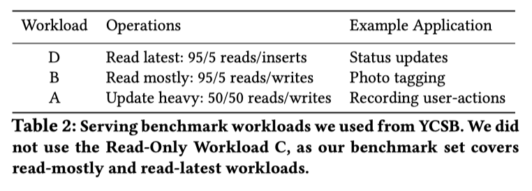
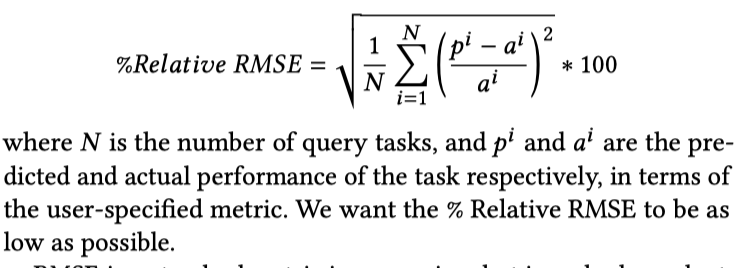

# Selecting the Best VM across Multiple Public Clouds: A Data-Driven Performance Modeling Approach

## Abstract
数量繁多的虚拟机种类让使用云服务的用户眼花缭乱，不同种类的虚拟机会对成本和性能产生重大影响。基于这一情况，本文提出了一个数据驱动系统PARIS，使用离线与在线数据混合的新颖模式建立模型，用小型数据集提供精确的性能预测。它能根据`不同用户指定的度量`预测工作量性能，为跨云服务商提供的多个虚拟机种类和工作量提供成本预算。与其它协作过滤和线性插值模型相比，PARIS能够更好地预测性能
## 1.Introduction
为了匹配迁移至云环境的不同性能要求和成本权衡要求，云服务商提供了各种各样的虚拟机。根据用户提出的目标和工作量准确经济地选择虚拟机十分重要但也十分困难。
近期研究总是聚焦于快速寻找虚拟机类型的优化技术和建立性能成本权衡的最佳模型。但有时不用的用户会在意性能成本平衡曲线上不同的点。比如有些用户可以为了大量的成本节约容忍轻微的性能减少。
### 难点：
* 对于给定的工作量，已经公开发布的虚拟机特征（如内存和虚拟核心）对性能的影响很难直接预测
* 性能通常取决于难以指定的工作量特征
* 在公开发布的虚拟机配置中难以捕获由选择不同的主机硬件、放置策略以及资源争用导致的性能变化
* 即使像Ernest通过广泛性能测量服这些困难，但是参数复杂度上升到了O(n*n)
* 无服务器计算框架也只是把挑战移交给了云提供商，云提供商尽管可以提供资源的详细信息，但是也无法看见所有工作量需求。
### PARIS可以：
* 估算所有虚拟机类型的性能成本权衡，允许用户平衡降低成本和性能提升之间的关系
* 是一种新颖的混合离线与在线数据集合和模型框架，使用最少数据集提供精确地性能预测
* 解耦了虚拟机性能特征和特定工作量资源要求特征，将这些阶段结合起来
### 本文工作：
* 对于Amazon AWS 和Microsoft Azure上实际工作负载的各种虚拟机类型进行性能权衡的描述性试验
* 一种新颖的混合离线与在线数据集合和模型框架，在为云运营商提供精确的性能测试时消除了O(n*n)的数据集合开销
* 详细的实验评估证明，证明PARIS可以准确地估算两个主要公共云提供商的多个实际工作负载的多个性能指标及其可变性，从而相对于强大的基线技术，可将用户成本降低多达45％
## 2.Motivation
为了阐述选择虚拟机类型时面临的挑战，本文针对两个云服务商Amazon AWS和Microsoft Azure提供的大量虚拟机类型评估了三种不同的工作量。
### 具体的示例：
* 软件构建系统案例 -> Apache Giaph的编译
* 服务器应用 -> 在Redis内存数据存储区运行YCSB查询
* 更加复杂利用多类资源的案例 -> 下载、解压缩、再压缩工作量
### 得出结论：
* 提供超过workload需要的资源对性能提升没有帮助
* 相似的配置可以提供不同的性能，所以单从虚拟机类型配置来说是无法预测性能的
* 针对平均性能进行优化可能无法针对最低性能进行优化，所以根据用户是要对平均性能进行优化还是最低性能进行优化所选择的虚拟机类型是不同的
* 工作量需求的要求是不透明的，无法知道哪一个资源配置对性能产生影响
### 总结
如果在所有云运营商提供的所有虚拟机类型运行所有的任务，这能让我们得到大量丰富的信息但却使得成本高昂。
因此需要找到一个精确测量所有虚拟机类型上测量任意工作性能更便宜的方式
## 3.System Overview
### 系统输入
* a representative task of her workload
    * user's code with a sample input data
* the desired performance metric
    * one of a few pre-defined metrics implemented in PARIS ,PARIS中实施的一些预定义指标之一
    * a snippet of code that implements a fuction of these metrics ,实现这些指标功能的一小段代码
* a set of candidate VM types
### 交互代码
* 获取目的虚拟机的性能成本估算
`perfCostMap = predictPerfCost(userWorkloadDocker , perfMetric , candidateVMs)`
* 根据最小成本选择虚拟机类型
`chosenVMType = minCost(perfCostMap , perfReq)`
### PARIS建模
* 建模任务 
    * 工作量的资源要求
    * 不同虚拟机类型在具有相同资源要求的工作量上的影响
* PARIS模型阶段划分
    * `Offline`一次性，离线，广泛性兼具的VM类型基准测试阶段
        * 使用分析器为每个虚拟机类型运行一套基准测试并且收集详细的系统性能指标
            * `基准测试`涵盖各种资源需求的各种实际工作负载模式。
        * 当引进新的虚拟机类型或者物理硬件时，基准测试只需要在这个新虚拟机上运行一次
    * `Online`在线的，不昂贵的工作量分析阶段
        * 用户输入：代表性任务`a representive task`和性能基准`performace benchmark`
        * 调用指纹生成器`Fingerprint-Generator`在一小部分参考虚拟机类型上运行`representive task`并收集运行时间的测量`runtime measurements`(measurements捕捉任务的资源使用模式，形成了工作量指纹`fingerprint`)
            * 尽管这一步需要花费时间，但是花费很小并且与候选虚拟机数量无关
    * 将online阶段获取的指纹信息和offline阶段的基准数据`benchmarking data`结合在一起，构建机器学习模型，精确预估所需的性能指标以及用户工作量的相应性能指标的第90个百分位值`90th percentile values`。
    * 整合所有测量数据，形成所有虚拟机的性能成本权衡图
## 4.Offline VM-Benchmarking Phase
选择种类、性能指标、资源需求多种多样的工作量，以便PARIS识别不同的虚拟机类型如何响应不同资源使用模式
* 使用Hive的连接聚类操作 -> OLAP的代表性的分析查询案例`OLAP-style analytical queries.`
* 在Aerospike,MongoDB,Redis和Cassandra数据存储中添加YCSB核心基准工作负载 -> 云端延时敏感型服务工作任务案例`latency-sensitive serving workloads in the cloud`
* 使用Squash压缩基准构建了一个模拟托管压缩服务的基准 -> 多阶段工作案例`multi-stage workload`
    * 该基准测试程序通过网络下载了压缩文件，然后对该文件进行解压缩和重新压缩，从而利用了计算，内存和磁盘资源。
### 具体操作
分类器记录一系列指标下每个基准任务的性能。每一个任务在每种虚拟机下运行10次以估算性能和p90值（每次一个），每隔15s使用Ganglia检测虚拟机捕获性能和资源计数器，并记录任务运行期间这些计数器的平均值（或总和，取决于计数器）
计数器类别组要涵盖：
* `CPU utilization`: CPU idle, system, user time, and CPU utilization in the last 1, 5, and 15 minutes.
* `Network utilization`: Bytes sent and received.
* `Disk utilization`: Ratio of free to total disk space, I/O utilization in the last 1, 5, and 15 minutes
* `Memory utilization`: Available virtual, physical, and shared memory, and the cache and buffer space.
* `System-level features`: Number of waiting, running, terminated, and blocked threads and the host load in the last 1, 5, and 15 minutes.
## 5.Online Performance Prediction
* 调用`Fingerprint-Generator`在事先定义好的参考虚拟机类型上运行用户指定任务（每个虚拟机上每个任务运行10次 -> 记录`90th percentile perfomace`），并用`Profiler`手机资源使用情况和性能数据
* 将两个参考虚拟机类型的资源使用测量值、平均性能和90th性能值 放入 一个叫`workload fingerprint`的向量F 
    * `fingerprint`：反应任务的资源使用情况
    * `VM type configuration`：反应可用资源
* 利用`fingerprint`和`VM type configuration`来预测性能 -> `随机森林算法`
### 5.1 Training the Random Forest Model
`g(fingerprint, target_vm) → (perf, p90)`
* 模型训练
    * 随机森林算法
        * 训练数据集：通过使用离线阶段收集的性能统计数据，计算的用户指定性能指标的平均和最差性能
    * 本模型中只需要2s来训练模型
    * 预测相对第一个参考虚拟机的性能规模而不是预测决定性能
* 模型输入
    * fingerprint：将在参考虚拟机上运行任务时收集的资源利用数量组合在一起。
    * target_vm：虚拟机配置，例如：the number of cores (Azure) or vcpus (AWS), amount of memory, disk size, and network performace and bandwidth
* 模型输出
    * 相对第一个参考虚拟机的平均性能
    * 相对第一个参考虚拟机的90th percentile性能
* 将相对于第一个参考虚拟机的平均和90th percentile性能乘以第一种虚拟机类型对应的值 -> 绝对性能
* 设定成本是性能指标和已公布的虚拟机每小时花费（作为额外参数输入）的函数
### 5.2 Interpreting the Learned Models
重要的特征是那些经常出现在决策树顶部附近的特征

## 6.Evaluation
### 6.1 Baselines
与PARIS相近的，智能使用已发布虚拟机配置预测成本的Baselines：
* 协同过滤`Collaborative Filtering`：构建矩阵，其中每个单元格（i，j）包含第j个虚拟机类型的第i个基准工作任务的性能指标值，对于两个虚拟机之间性能比较采用矩阵补全方法
* Baseline1：根据一些资源选择最大的虚拟机种类VM1和最小的虚拟机种类VM2，对应性能p1和p2则目标虚拟机种类的p(target) = (p1 + p2)/2
* Baseline2：线性插值，虚拟机种类VM1内存为m1，虚拟机类型VM2内存为m2，则预测内存性能为p(m) = p1 + (p2-p1)*(m-m1)/(m2-m1)，其中内存可以替换成其他资源，最后求平均数
### 6.2 Experimental Set-up
* 使用以下两种工作量来评估PARIS性能
    * 视频编码（在线阶段测试模型），压缩（离线阶段基准测试）之类的应用
    * Serving-style延迟以及对吞吐量敏感的OLTP工作
        * 使用的四个常见的云服务数据存储：Aerospike，MongoDB，Redis和Cassandra
        * 离线阶段：使用YCSB框架中的多个workload D,B,A 
        
        * 在线阶段：通过改变读取/写入/扫描/插入比例和请求分配来实现新的现实服务工作
* 评估模型预测的指标
    * 直接比较实际性能和预测性能
    * 百分比均方根误差`percentage RMSE( Root Mean Squared Error)`
    
### 6.3 Prediction accuracy of PARIS
a)视频编码任务 性能预测指标 -> 运行时间
b)服务类型OLTP任务 性能预测指标 -> 延迟和吞吐量
* 整体预测误差
* 融合过滤基线比较：矩阵补全技术会忽略VM配置和PARIS使用的资源利用率信息，所以表现很差后续不再予以考虑
* 每一个虚拟机种类的上预测错误
以上每一种比较表明，PARIS预测准确性远远高于其它Baselines
### 6.4 Robustness
分别使用实例显示PARIS对参考虚拟机类型、数量选择，对随机森林超参数的选择，对工作量基准的选择都不敏感
### 6.5 From Estimated Performance to Action
PARIS将其性能预测显示为性能成本权衡图，该图将每种虚拟机类型映射到相应的性能成本权衡
### 6.6 Quantifying cost savings
* 通过更好的决策降低用户成本
    * 策略I：如果预测的运行时间小于用户指定的阈值，则策略I选择估计成本最低的VM类型，该阈值表示为跨VM类型的平均预测的运行时间的分数β。
    * 策略II：策略II代替预测的运行时间，而是使用预测的p90根据相同的准则选择VM类型。此策略优化了最坏情况下的性能。
* PARIS间接产生的额外成本远低于其它方法
## 7.Limitations and next steps
* 可以拓展PARIS模型方程以包括一些指定任务特征，例如输入大小
* 可以拓展PARIS在多个服务商之间使用通用指纹
* 可以和Ernest结合起来解决集群预测问题
* 可以拓展为与cloud中可以定制大小的虚拟机一起使用
## 8.Related work
* 基于系统建模进行性能预测
    * Ernest：预测分布式分析作业的运行时间是集群大小的函数。但是，如果没有先在该VM类型上运行工作负载，Ernest就无法推断该VM类型上新工作负载的性能
    * Quasar：通过从一些性能分析运行中推断性能来预测各种资源分配决策对工作负载性能的性能影响
    * PARIS：获取的信息更详细
* 干扰预测
    * 动态监控硬件级别特征CPI,CMR进行干扰预测
    * 相比而言PARIS信息量更大也更容易在云环境中安装
* 自适应控制系统
    * Rightscale：当应用程序的负载超过阈值时，EC2的Rightscale将创建其他VM实例
    * Yarn：根据应用程序的请求确定资源需求
    * Wranler：识别了map-reduce集群中的过载节点，并延迟了在其上调度作业的时间
    * Quasar：动态更新对应用程序性能对异构性，干扰，资源扩展和扩展的敏感性的估计
    * PARIS：不控制在线调度决策，但可以用于将应用程序的要求告知资源管理系统
## 9.Conclusion
PARIS：一个通过精确经济的性能预测，帮助用户选择满足性能要求和成本限制的正确的虚拟类型的系统。
* 解耦了虚拟机类型特征和工作量特征
* 消除了对多个云服务商提供的虚拟机类型进行性能预测是产生的O(n*n)的性能估算成本

经验结果表明PARIS：
* 精确预测现实工作任务的平均和最差性能，以及跨多个云上的性能指标
* 在达到性能目标的同时，提供更加经济效益的决策
## Acknowledgments

cost_per_hour 怎么获得
https://www.amazonaws.cn/ec2/pricing/ec2-linux-pricing/?nc1=h_ls